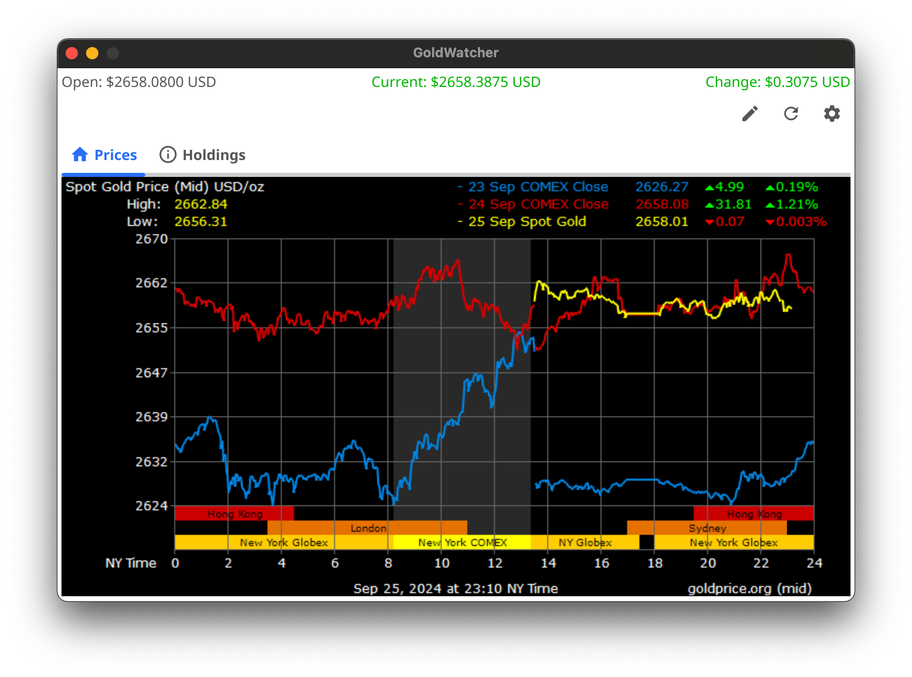
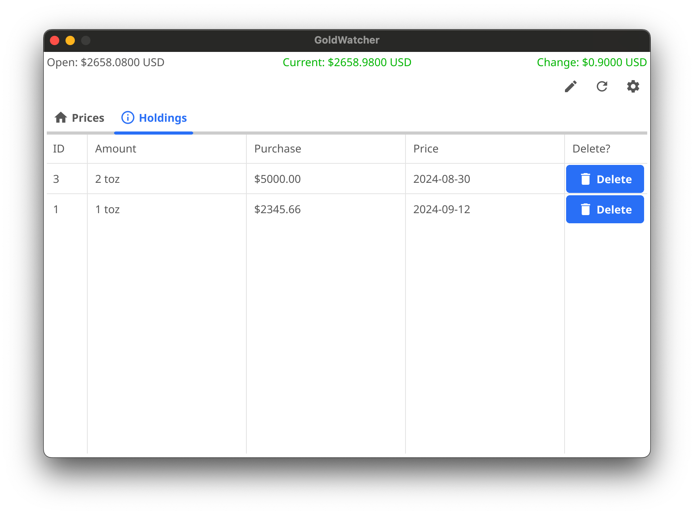

# GoldWatcher

<div align="center">
  
  
</div>

<div align="center">
  
  
</div>

<p align="center">
  A simple Gold tracking <i>desktop App</i> which uses <a href="https://goldprice.org/" target="_blank">goldprice.org</a> APIs, written in <b>Go</b> and <b>Fyne</b> using embedded <b>SQLite</b> for keeping all the date in users machines.
</p>

## ▶️ Running and Installing
- Run the following command for aligning dependencies
```bash
go mod tidy
```

- Then run following commands for running or building the app
```bash
make run # for running the app
make build # for building the app
```

You can find configs for building the app in `Makefile`.

<hr>

### In this repo you can find various solutions and use them in your project such as

- How to connect embedded **SQLite** DB to your Go application and do basic CRUD operations
- How to write **SQL queries** directly in your Go application
- Usage of different and various features of **Fyne** library for full desktop experience

---

**Feeling lucky?** Give it a star ⭐ and fork for adding something from your side 😊.